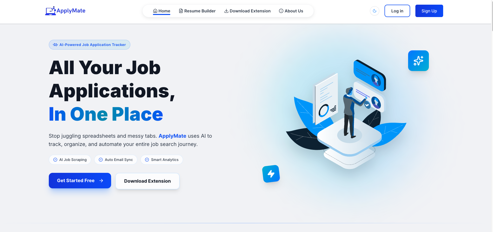

<div align="center">
  


# 🚀 ApplyMate - AI-Powered Job Application Tracker

**Stop juggling spreadsheets and messy tabs. ApplyMate uses AI to track, organize, and automate your entire job search journey.**

[](https://apply-mate-two.vercel.app/)
[](https://nextjs.org/)
[](https://www.typescriptlang.org/)
[](https://www.mongodb.com/)
[](./LICENSE)

[Live Demo](https://apply-mate-two.vercel.app/) • [Report Bug](https://github.com/your-repo/issues) • [Request Feature](https://github.com/your-repo/issues)

</div>

---

## 📖 Table of Contents

- [About ApplyMate](#-about-applymate)
- [Key Features](#-key-features)
- [AI-Powered Features](#-ai-powered-features)
- [Tech Stack](#️-tech-stack)
- [Getting Started](#-getting-started)
- [Chrome Extension](#-chrome-extension)
- [Project Structure](#-project-structure)
- [Environment Variables](#-environment-variables)
- [Team](#-team)
- [Contributing](#-contributing)
- [License](#-license)

---

## 🎯 About ApplyMate

ApplyMate is a **comprehensive AI-powered job application management system** that helps job seekers organize, track, and manage all their job applications in one centralized platform. 

### The Problem We Solve

Job hunting is chaotic:
- ❌ Applying on different websites
- ❌ Tracking application status manually
- ❌ Remembering interview schedules
- ❌ Managing follow-ups across platforms
- ❌ Scattered spreadsheets and lost opportunities

### Our Solution

ApplyMate provides:
- ✅ **Centralized Dashboard** - All applications in one place
- ✅ **AI-Powered Automation** - Smart job scraping and email sync
- ✅ **Real-Time Analytics** - Track your job search progress
- ✅ **Gmail Integration** - Auto-update application status
- ✅ **Chrome Extension** - One-click job saving from any site

**Save 5-10 hours per week** on manual tracking and focus on what matters: landing your dream job! 🎯

---

## ✨ Key Features

### 🏠 **Smart Dashboard**
- Centralized view of all job applications
- Real-time status tracking (Applied → Interview → Offer → Rejected)
- Interactive analytics and insights
- Visual progress tracking with charts

### 📝 **Application Management**
- Add, edit, and delete job applications
- Store comprehensive job details (company, role, location, description)
- Track applied dates and interview schedules
- Add notes and custom fields

### 🔍 **Advanced Search & Filter**
- Filter by company, role, status, and date range
- Advanced search capabilities
- Custom sorting options
- Quick filters for better organization

### 📊 **Analytics & Insights**
- Application success rates
- Company-wise application tracking
- Time-based analytics and trends
- Visual dashboard with charts

### 📄 **Resume Builder**
- Professional resume templates
- Drag-and-drop section reordering
- PDF export functionality
- Multiple resume versions

---

## 🤖 AI-Powered Features

### 🔧 **AI Chrome Extension**

> **Powered by Google Gemini 2.0 Flash** - State-of-the-art job data extraction

- **Universal Job Scraping**: Works on LinkedIn, Indeed, Glassdoor, and ANY job board
- **Smart Data Extraction**: AI automatically identifies job title, company, location, type, and description
- **Future-Proof**: No site-specific code - adapts automatically when sites change
- **Multi-Language Support**: Works with job listings in any language
- **One-Click Save**: Instant job saving to your dashboard
- **95%+ Accuracy**: Google Gemini ensures precise data extraction

**Why AI-First?**
| Aspect | Traditional Scraping | AI-First Approach |
|--------|---------------------|-------------------|
| Setup | Site-specific selectors | Universal content extraction |
| Maintenance | Breaks when sites update | Adapts automatically |
| New Sites | Requires code changes | Works immediately |
| Languages | English only | Multi-language support |
| Accuracy | 60-70% | 85-95% |

### 📧 **AI Gmail Integration**

> **Powered by Google Gemini AI** - Intelligent email processing

- **Smart Email Detection**: Automatically identifies job-related emails
- **Status Auto-Update**: Detects interview invitations, offers, and rejections
- **Intelligent Parsing**: Extracts company names and position details
- **24-Hour Sync**: Processes last 24 hours of emails intelligently
- **Privacy-First**: Emails processed securely with OAuth 2.0

**How It Works:**
1. Connect your Gmail account (secure OAuth 2.0)
2. AI scans last 24 hours for job emails
3. Gemini AI analyzes email content
4. Application status updates automatically
5. Get notified of changes

### 🎯 **AI-Powered Analytics**
- Smart insights on application patterns
- Success rate predictions
- Best time to apply recommendations
- Company response time analysis

---

## 🛠️ Tech Stack

### **Frontend**


- **Framework**: Next.js 15.5 with App Router
- **Language**: TypeScript 5.0
- **Styling**: Tailwind CSS 4.0 + shadcn/ui components
- **State Management**: React Query (@tanstack/react-query)
- **Forms**: React Hook Form + Zod validation
- **Animations**: Framer Motion, GSAP, Lottie React
- **Icons**: Lucide React
- **UI Components**: Radix UI primitives

### **Backend & Database**


- **API**: Next.js API Routes (serverless)
- **Database**: MongoDB Atlas with native driver
- **Authentication**: NextAuth.js 4.24
  - Email/Password authentication with bcryptjs
  - Google OAuth 2.0 integration
  - Secure session management
- **Email Service**: Resend API + Nodemailer
- **File Storage**: Cloudinary (avatars & images)

### **AI & Integrations**


- **AI Engine**: Google Gemini 2.0 Flash (@google/genai)
- **Gmail Integration**: Google APIs (googleapis)
  - OAuth 2.0 authentication
  - Email reading and processing
  - Smart job email detection
- **Chrome Extension**: Manifest V3
  - AI-powered job scraping
  - Universal content extraction
  - Secure token management

### **Developer Tools**
- **Linting**: ESLint 9 with Next.js config
- **Code Quality**: Prettier, TypeScript strict mode
- **Version Control**: Git with Conventional Commits (Commitizen)
- **Package Manager**: npm

### **Deployment & Hosting**


- **Primary**: Vercel (optimized for Next.js)
- **Alternative**: Netlify (with plugin support)
- **Database**: MongoDB Atlas (cloud)
- **CDN**: Cloudinary
- **Monitoring**: Vercel Analytics

---

## 🚀 Getting Started

### Prerequisites

Before you begin, ensure you have:

- **Node.js** 18+ installed ([Download](https://nodejs.org/))
- **MongoDB Atlas** account ([Sign up](https://www.mongodb.com/cloud/atlas))
- **Google Cloud Console** project for OAuth ([Console](https://console.cloud.google.com/))
- **Gmail API** credentials ([Setup Guide](https://developers.google.com/gmail/api/quickstart/nodejs))
- **Google Gemini API** key ([Get API Key](https://aistudio.google.com/app/apikey))
- **Chrome Browser** for extension development

### Installation

1. **Clone the repository**
   ```bash
   git clone https://github.com/your-username/apply-mate.git
   cd apply-mate
   ```

2. **Install dependencies**
   ```bash
   npm install
   ```

3. **Environment Setup**
   
   Create a `.env.local` file in the root directory with the following variables:

   ```env
   # App Configuration
   NEXTAUTH_URL=http://localhost:3000
   NEXTAUTH_SECRET=your_nextauth_secret_here
   
   # MongoDB
   MONGODB_URI=your_mongodb_connection_string
   DB_NAME=applymate
   
   # Google OAuth (NextAuth)
   GOOGLE_ID=your_google_oauth_client_id
   GOOGLE_SECRET=your_google_oauth_client_secret
   
   # Gmail API Integration
   GMAIL_CLIENT_ID=your_gmail_api_client_id
   GMAIL_CLIENT_SECRET=your_gmail_api_client_secret
   GMAIL_REDIRECT_URI=http://localhost:3000/api/auth/gmail/callback
   
   # Google Gemini AI
   GOOGLE_GEMINI_API_KEY=your_gemini_api_key
   
   # Groq API (Alternative AI - Optional)
   GROQ_API_KEY=your_groq_api_key
   
   # Email Service (Resend)
   RESEND_API_KEY=your_resend_api_key
   RESEND_FROM_EMAIL=onboarding@yourdomain.com
   
   # Cloudinary (Image Upload)
   NEXT_PUBLIC_CLOUDINARY_CLOUD_NAME=your_cloud_name
   CLOUDINARY_API_KEY=your_cloudinary_api_key
   CLOUDINARY_API_SECRET=your_cloudinary_api_secret
   
   # Cron Job Secret (Optional)
   CRON_SECRET=your_cron_secret
   ```

4. **Database Setup**
   - Create a MongoDB Atlas cluster
   - Get your connection string
   - Add it to `MONGODB_URI` in `.env.local`

5. **Google Cloud Setup**
   
   **For OAuth:**
   - Go to [Google Cloud Console](https://console.cloud.google.com/)
   - Create a new project or select existing
   - Enable "Google+ API"
   - Create OAuth 2.0 credentials
   - Add authorized redirect URIs: `http://localhost:3000/api/auth/callback/google`
   
   **For Gmail API:**
   - Enable "Gmail API" in the same project
   - Create OAuth 2.0 credentials for Gmail
   - Add redirect URI: `http://localhost:3000/api/auth/gmail/callback`
   
   **For Gemini AI:**
   - Go to [Google AI Studio](https://aistudio.google.com/)
   - Create API key
   - Add to `GOOGLE_GEMINI_API_KEY`

6. **Run the development server**
   ```bash
   npm run dev
   ```

7. **Open your browser**
   
   Navigate to [http://localhost:3000](http://localhost:3000)

🎉 **You're all set!** ApplyMate should now be running locally.

---

## 🔧 Chrome Extension

### Installation & Setup

1. **Configure Backend API Key**
   - Ensure `GOOGLE_GEMINI_API_KEY` is set in `.env.local`
   - Restart your Next.js server

2. **Install Extension in Chrome**
   - Open Chrome and go to `chrome://extensions/`
   - Enable "Developer mode" (toggle in top-right)
   - Click "Load unpacked"
   - Select the `chrome-extension` folder from your project
   - Extension will appear in your toolbar

3. **Configure Extension**
   - Click the ApplyMate icon in browser toolbar
   - Enter your email address
   - Click "Save Email"
   - ✅ Ready to scrape jobs!

### Usage

1. **Navigate to any job listing** (LinkedIn, Indeed, Glassdoor, etc.)
2. **Click the ApplyMate extension icon**
3. **Click "Scrape Current Job"**
4. AI extracts and saves job details automatically
5. View the job in your ApplyMate dashboard

### Supported Job Sites

The extension works universally on:
- ✅ LinkedIn Jobs
- ✅ Indeed
- ✅ Glassdoor
- ✅ Monster
- ✅ CareerBuilder
- ✅ ZipRecruiter
- ✅ AngelList
- ✅ Remote.co
- ✅ We Work Remotely
- ✅ **Any job listing website** (AI-powered)

### Download Extension

📦 **[Download ApplyMate Extension](./public/apply-mate-extension.zip)**

---

## 📁 Project Structure

```
apply_mate/
├── src/
│   ├── app/
│   │   ├── (auth)/                 # Authentication pages
│   │   │   ├── login/              # Login page with form
│   │   │   ├── signup/             # Signup page with form
│   │   │   ├── forgot-password/    # Password recovery
│   │   │   └── reset-password/     # Password reset
│   │   │
│   │   ├── api/                    # API routes (Next.js)
│   │   │   ├── auth/               # Authentication endpoints
│   │   │   │   ├── [...nextauth]/  # NextAuth handler
│   │   │   │   ├── login/          # Login API
│   │   │   │   ├── signup/         # Signup API
│   │   │   │   └── gmail/          # Gmail OAuth
│   │   │   │
│   │   │   ├── jobs/               # Job management APIs
│   │   │   ├── gmail/              # Gmail integration APIs
│   │   │   ├── extension/          # Chrome extension APIs
│   │   │   ├── profile/            # User profile APIs
│   │   │   ├── reviews/            # User reviews
│   │   │   └── cron/               # Scheduled jobs
│   │   │
│   │   ├── dashboard/              # Main dashboard
│   │   │   ├── my-applications/    # Application tracking
│   │   │   ├── gmail-integration/  # Gmail settings
│   │   │   ├── profile/            # User profile
│   │   │   └── review/             # Leave a review
│   │   │
│   │   ├── resume/                 # Resume builder
│   │   │   ├── components/         # Resume components
│   │   │   └── types/              # Resume types
│   │   │
│   │   ├── components/             # Shared components
│   │   │   ├── banner-section.tsx  # Hero section
│   │   │   ├── feature-section.tsx # Features
│   │   │   ├── Testimonials.tsx    # User reviews
│   │   │   ├── FAQ.tsx             # FAQ section
│   │   │   └── shared/             # Footer, Navbar
│   │   │
│   │   ├── about/                  # About page
│   │   ├── download/               # Extension download
│   │   ├── jobs/                   # Job listings (future)
│   │   └── terms/                  # Terms & conditions
│   │
│   ├── components/                 # Reusable UI components
│   │   └── ui/                     # shadcn/ui components
│   │
│   ├── hooks/                      # Custom React hooks
│   │   ├── useAxiosSecure.ts       # Axios with auth
│   │   ├── useSignup.ts            # Signup logic
│   │   └── useUserJobs.ts          # Job fetching
│   │
│   ├── lib/                        # Utility functions
│   │   └── utils.ts                # Helper functions
│   │
│   ├── libs/                       # Core libraries
│   │   └── mongodb.ts              # MongoDB connection
│   │
│   ├── providers/                  # React providers
│   │   └── NextAuthSessionProvider.tsx
│   │
│   ├── types/                      # TypeScript definitions
│   │   └── next-auth.d.ts          # NextAuth types
│   │
│   └── utils/                      # Backend utilities
│       ├── authOptions.ts          # NextAuth config
│       └── gmailHelpers.ts         # Gmail API helpers
│
├── chrome-extension/               # Chrome extension files
│   ├── manifest.json               # Extension config (v3)
│   ├── popup.html                  # Extension popup UI
│   ├── popup.js                    # Popup logic
│   ├── content.js                  # Content script (AI)
│   ├── background.js               # Service worker
│   └── icons/                      # Extension icons
│
├── public/                         # Static assets
│   ├── assets/                     # Images & logos
│   ├── Team-assets/                # Team member photos
│   ├── data/                       # JSON data files
│   └── apply-mate-extension.zip    # Extension download
│
├── components.json                 # shadcn/ui config
├── next.config.ts                  # Next.js configuration
├── tailwind.config.js              # Tailwind CSS config
├── tsconfig.json                   # TypeScript config
└── package.json                    # Dependencies
```

---

## 🔐 Environment Variables

<details>
<summary><b>Click to see all environment variables explained</b></summary>

### App Configuration
- `NEXTAUTH_URL`: Your app URL (e.g., `http://localhost:3000`)
- `NEXTAUTH_SECRET`: Random secret for NextAuth (generate with `openssl rand -base64 32`)

### Database
- `MONGODB_URI`: MongoDB connection string
- `DB_NAME`: Database name (default: `applymate`)

### Google OAuth (NextAuth)
- `GOOGLE_ID`: Google OAuth client ID
- `GOOGLE_SECRET`: Google OAuth client secret

### Gmail API
- `GMAIL_CLIENT_ID`: Gmail API client ID
- `GMAIL_CLIENT_SECRET`: Gmail API client secret
- `GMAIL_REDIRECT_URI`: Gmail OAuth redirect URI

### AI Services
- `GOOGLE_GEMINI_API_KEY`: Google Gemini AI API key
- `GROQ_API_KEY`: Groq API key (optional alternative)

### Email Service
- `RESEND_API_KEY`: Resend API key for transactional emails
- `RESEND_FROM_EMAIL`: Sender email address

### Image Upload
- `NEXT_PUBLIC_CLOUDINARY_CLOUD_NAME`: Cloudinary cloud name
- `CLOUDINARY_API_KEY`: Cloudinary API key
- `CLOUDINARY_API_SECRET`: Cloudinary API secret

### Cron Jobs
- `CRON_SECRET`: Secret for scheduled job endpoints

</details>

---

## 👥 Team

Meet the talented team behind ApplyMate:

<table>
  <tr>
    <td align="center">
      <br/>
      <b>Sanjida Rimi</b><br/>
      <sub>Full Stack Developer</sub><br/>
      <a href="https://github.com/sanjidaRimi023">GitHub</a> •
      <a href="https://www.linkedin.com/in/sanjida-akter-rimi711909/">LinkedIn</a> •
      <a href="https://sanjidarimi.vercel.app/">Portfolio</a>
      <br/>
      <sub>Builds end-to-end solutions with beautiful interfaces & secure authentication</sub>
    </td>
    <td align="center">
      <br/>
      <b>Md Iftekharul Alam</b><br/>
      <sub>Full Stack Developer & AI Specialist</sub><br/>
      <a href="https://github.com/iftekhar08019">GitHub</a> •
      <a href="https://www.linkedin.com/in/mdiftekharulalam21/">LinkedIn</a> •
      <a href="https://iftekhar-web.web.app/">Portfolio</a>
      <br/>
      <sub>Develops Chrome extensions & integrates AI APIs</sub>
    </td>
    <td align="center">
      <br/>
      <b>Mohammad</b><br/>
      <sub>Frontend Developer</sub><br/>
      <a href="https://github.com/Mohammad7558/">GitHub</a> •
      <a href="https://www.linkedin.com/in/mohammod-bin-amin-b051a0244/">LinkedIn</a> •
      <a href="https://iam-mohammad.vercel.app/">Portfolio</a>
      <br/>
      <sub>Crafts beautiful, responsive UIs with Next.js & TypeScript</sub>
    </td>
  </tr>
</table>

---

## 🤝 Contributing

We welcome contributions from the community! Here's how you can help:

### How to Contribute

1. **Fork the repository**
   ```bash
   git clone https://github.com/your-username/apply-mate.git
   ```

2. **Create a feature branch**
   ```bash
   git checkout -b feature/amazing-feature
   ```

3. **Make your changes**
   - Write clean, documented code
   - Follow the existing code style
   - Add comments where necessary

4. **Commit your changes**
   ```bash
   git commit -m 'Add some amazing feature'
   ```
   We use [Conventional Commits](https://www.conventionalcommits.org/). Example:
   - `feat: add new job filter`
   - `fix: resolve Gmail sync issue`
   - `docs: update README`

5. **Push to your fork**
   ```bash
   git push origin feature/amazing-feature
   ```

6. **Open a Pull Request**
   - Describe your changes
   - Reference any related issues
   - Wait for review

### Development Guidelines

- ✅ Write TypeScript (not JavaScript)
- ✅ Use Tailwind CSS for styling
- ✅ Follow component structure conventions
- ✅ Test your changes thoroughly
- ✅ Update documentation if needed
- ✅ Ensure no ESLint errors

### Areas We Need Help

- 🐛 Bug fixes and testing
- 🎨 UI/UX improvements
- 📝 Documentation
- 🌐 Internationalization (i18n)
- ♿ Accessibility improvements
- 🧪 Writing tests

---

## 📋 Roadmap

### ✅ Completed
- [x] Project setup (Next.js 15 + MongoDB)
- [x] User authentication (Email & Google OAuth)
- [x] Dashboard with CRUD operations
- [x] AI-powered Chrome Extension
- [x] Gmail integration with AI
- [x] Resume builder
- [x] Analytics dashboard
- [x] Production deployment

### 🚧 In Progress
- [ ] Mobile responsive improvements
- [ ] Advanced analytics features
- [ ] Job recommendations system

### 📅 Future Enhancements
- [ ] AI-powered resume feedback
- [ ] Interview preparation tools
- [ ] Job recommendation engine
- [ ] Team collaboration features
- [ ] Mobile app (React Native)
- [ ] Integration with more job boards
- [ ] Calendar integration (Google Calendar)
- [ ] Slack/Discord notifications
- [ ] API for third-party integrations

---

## 📊 Performance & Stats

- ⚡ **Lighthouse Score**: 95+ (Performance, Accessibility, SEO)
- 🚀 **Load Time**: < 2 seconds (Vercel edge network)
- 📦 **Bundle Size**: Optimized with Next.js 15
- 🤖 **AI Accuracy**: 95%+ (Google Gemini 2.0)
- ⏱️ **Time Saved**: 5-10 hours/week per user

---

## 🔒 Security & Privacy

- 🔐 **Authentication**: Secure NextAuth.js with bcrypt hashing
- 🔑 **OAuth 2.0**: Industry-standard Google OAuth
- 🛡️ **Data Protection**: MongoDB Atlas encryption at rest
- 🌐 **HTTPS**: All communication encrypted in production
- 📧 **Email Privacy**: Gmail API with minimal permissions
- 🔒 **Token Security**: Secure token storage and rotation

**We never:**
- ❌ Sell your data
- ❌ Share emails without permission
- ❌ Store plain-text passwords
- ❌ Track you across websites

---

## 🐛 Known Issues & Solutions

<details>
<summary><b>Gmail API Verification</b></summary>

**Issue**: Gmail API requires verification for production use with >100 users.

**Solution**: We're in the verification process. For now, the app works in development/test mode.
</details>

<details>
<summary><b>Chrome Extension Permissions</b></summary>

**Issue**: Extension requires broad permissions for universal job scraping.

**Why**: Needed to access job site content and send to API. We only access pages you explicitly scrape.
</details>

<details>
<summary><b>Rate Limiting</b></summary>

**Issue**: Free tier limits on Gmail API and Gemini API.

**Solution**: Implement request caching and batch processing. Consider upgrading to paid tiers for heavy use.
</details>

---

## 📄 License

This project is licensed under the **MIT License** - see the [LICENSE](./LICENSE) file for details.

```
MIT License

Copyright (c) 2025 ApplyMate Team

Permission is hereby granted, free of charge, to any person obtaining a copy
of this software and associated documentation files (the "Software"), to deal
in the Software without restriction, including without limitation the rights
to use, copy, modify, merge, publish, distribute, sublicense, and/or sell
copies of the Software, and to permit persons to whom the Software is
furnished to do so, subject to the following conditions:

The above copyright notice and this permission notice shall be included in all
copies or substantial portions of the Software.

THE SOFTWARE IS PROVIDED "AS IS", WITHOUT WARRANTY OF ANY KIND, EXPRESS OR
IMPLIED, INCLUDING BUT NOT LIMITED TO THE WARRANTIES OF MERCHANTABILITY,
FITNESS FOR A PARTICULAR PURPOSE AND NONINFRINGEMENT.
```

---

## 📞 Support & Contact

Need help? Have questions? We're here for you!

- 📧 **Email**: support@applymate.com
- 🐛 **Bug Reports**: [GitHub Issues](https://github.com/your-repo/issues)
- 💡 **Feature Requests**: [GitHub Discussions](https://github.com/your-repo/discussions)
- 📖 **Documentation**: [Wiki](https://github.com/your-repo/wiki)
- 💬 **Community**: Join our [Discord](https://discord.gg/applymate)

---

## 🙏 Acknowledgments

Special thanks to:

- [Next.js](https://nextjs.org/) - The React framework
- [Vercel](https://vercel.com/) - Deployment platform
- [MongoDB](https://www.mongodb.com/) - Database
- [Google](https://ai.google.dev/) - Gemini AI & Gmail API
- [shadcn/ui](https://ui.shadcn.com/) - Beautiful UI components
- [Tailwind CSS](https://tailwindcss.com/) - Styling framework
- All our amazing [contributors](https://github.com/your-repo/graphs/contributors)

---

## ⭐ Star History

If you find ApplyMate useful, please consider giving it a star ⭐

[](https://github.com/your-username/apply-mate)

---

<div align="center">

### Made with ❤️ for job seekers everywhere

**ApplyMate** - *Your job application journey, simplified.*

[Live Demo](https://apply-mate-two.vercel.app/) • [Documentation](https://github.com/your-repo/wiki) • [Download Extension](./public/apply-mate-extension.zip)

---

*Stop juggling spreadsheets. Start landing jobs.* 🚀

</div>
